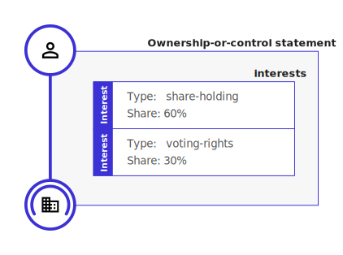
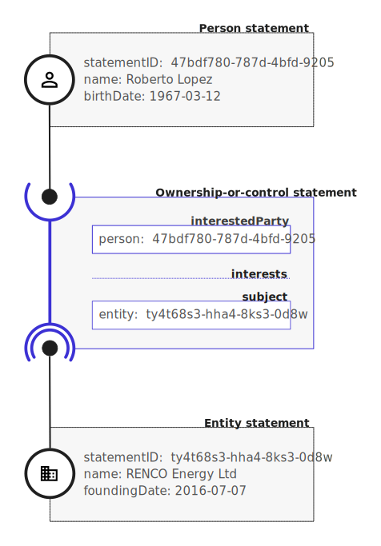

Modelling beneficial ownership information
==========================================

The concept of a 'statement' is at the heart of the Beneficial Ownership Data Standard. Data is packaged up into collections of:

* Beneficial ownership statements
* Entity statements
* Person statements
* Arrangement statements

## Statements

Details of how an interested party controls or owns a company or other legal entity are wrapped in a Beneficial ownership statement.



Details of the subject of a beneficial ownership statement and its interested party are wrapped in their own statements. The beneficial ownership statement refers out to these statements, acting as a connector.




## Statements as claims

Each statement represents a claim about beneficial ownership made by a particular source at a particular point in time.


Modelling beneficial ownership information in this way allows us to make sense of data received from multiple sources over extended periods of time. In particular, it allows:

* Statements about beneficial ownership to conflict.
* Statements about beneficial ownership to overlap.
* Production of historical beneficial ownership snapshots: what was known when. (Known as [bi-temporal modelling](https://en.wikipedia.org/wiki/Bitemporal_Modeling).)

When representing data conforming to the Standard, users should therefore handle statements with due care. Ultimately it is up to data consumers to decide which statements to trust (and to verify identities using the [identifying information](identifiers.md) contained in person and entity statements).


## Anatomy of a statement - the data model

(ID and dating info plus language around fields and values.)


## Immutability of statements

Statements **must** be treated as immutable: once a statement is published it **must not** be republished with the same ```statementID``` and different field values. If a field needs to be updated, a new statement with a new ```statementID``` must be published and the ```replacesStatement``` property used. See [Updating statements](updating-statements.md).


