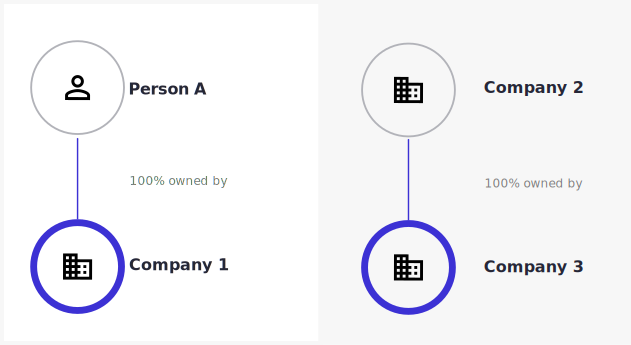

# What is beneficial ownership?

The concept of beneficial ownership helps us understand how companies and other legal entities are owned and controlled.

The idea that people own companies and sometimes companies own companies is well understood.



Even when companies own companies, individuals always appear at the end of the ownership chain. They ultimately benefit from companies’ financial successes, and often share in its failures.

Often if a person owns something, they have control over it. Owning shares in a company may confer voting rights, for example. But ownership and control are sometimes separated - by contracts, agreements and other mechanisms.

Here, an executive director has the right to appoint 60% of the other board members. This level of control over a company’s prospects may bring benefits and risks.

Beneficial ownership therefore takes in both types of involvement with a company: ownership and control. 

```eval_rst 

.. note:: 
    
    **Beneficial ownership** is the right to some share of a legal entity's income or assets (ownership) or the right to direct or influence the entity's activities (control).

```


